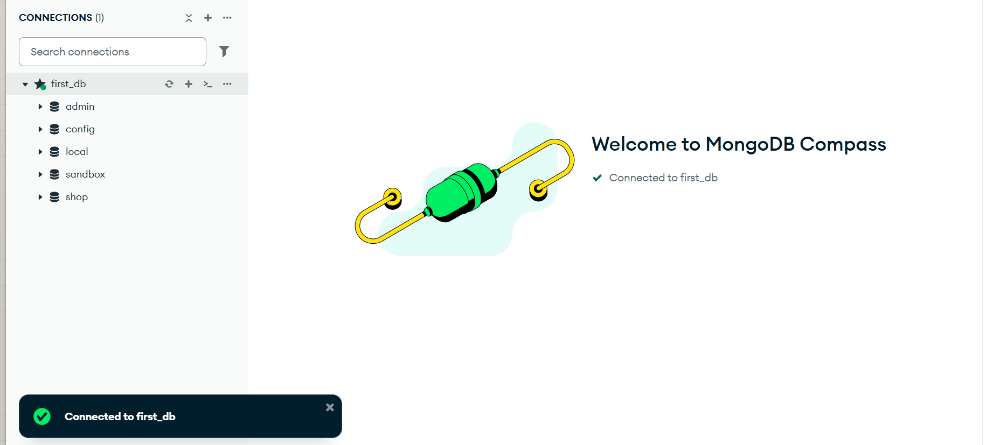
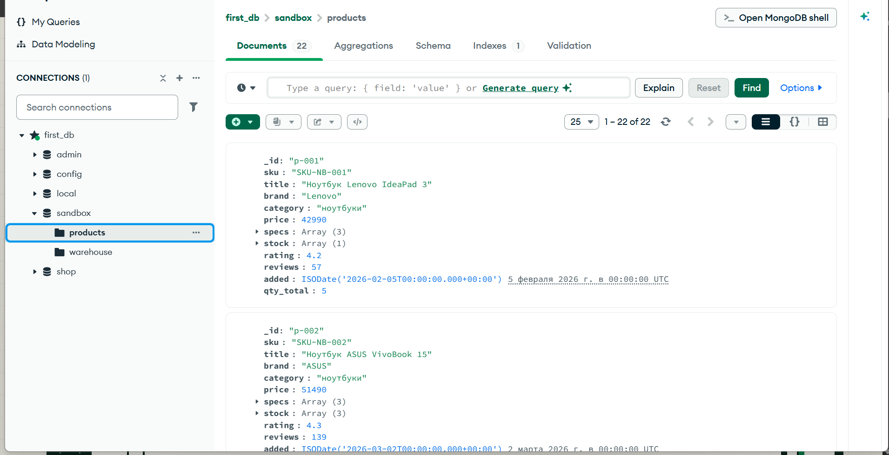
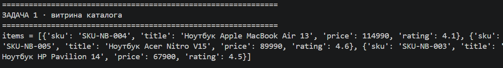
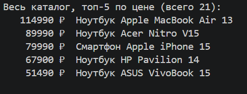
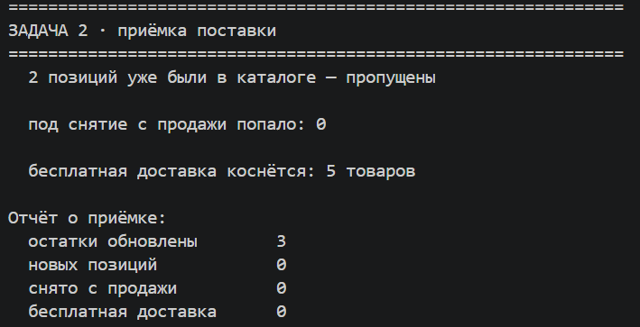
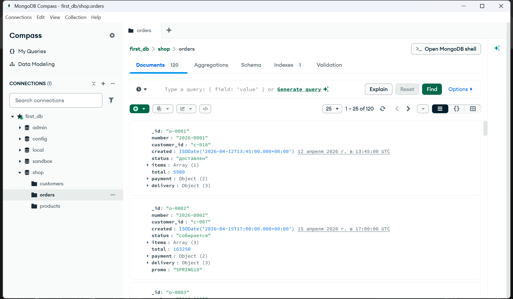

# Домашнее задание № 3 · «Каталог товаров»

Срок — до начала следующего занятия.

## Задание

Выполните практическую работу из справочника:

<https://maximbytecamp.github.io/mongodb_theory_makarov/praktiki/01-katalog-tovarov/index.html>

Работайте в своей копии `data-platform-template`. Если практика предлагает
несколько вариантов запуска, укажите в отчёте выбранный вариант. Все команды и
запросы должны быть выполнены на вашей базе MongoDB.

## Что должно быть сделано

1. Запустить MongoDB и программу каталога.
2. Создать или загрузить товары, предусмотренные практикой.
3. Выполнить все операции практической работы: чтение каталога, поиск/фильтрацию
   и остальные операции, указанные в инструкции.
4. Проверить результат непосредственно в MongoDB Compass или в терминале.
5. Заполнить этот файл и приложить скриншоты.

## Скриншоты

Положите в `lesson_03/screens/` шесть PNG или JPG. Текст команды и результата
должен быть читаемым; на кадре должно быть понятно, какая программа запущена.

| Файл | Что должно быть видно |
|---|---|
| `01-program-start.png` | Запущенная программа каталога или успешное подключение к MongoDB; видна команда запуска или окно приложения |
| `02-products-created.png` | Результат создания/загрузки товаров: сообщение программы, список или ответ MongoDB |
| `03-catalog-result.png` | Вывод каталога после чтения документов; видны названия и основные поля товаров |
| `04-search-result.png` | Условие поиска/фильтра и найденные товары |
| `05-update-or-delete-result.png` | Результат изменения или удаления товара; если такого шага нет, приложите следующий результат практики и объясните это ниже |
| `06-database-check.png` | Проверка в Compass или терминале: коллекция, документы, количество или ответ запроса |

Дополнительные кадры разрешены. Не показывайте пароли, токены, приватные адреса
и персональные данные.

## Заполните отчёт

**ФИО:** Еремеев Иван Иванович  
**Группа:** 9/4-РПО-23/1 
**Дата:** 16.09.2026

### Среда выполнения

- ОС: Windows 11
- Язык и версия: Python 3.11
- MongoDB / Compass: MondgoDB Compass 8.3.9
- База данных: Shop
- Коллекция: Orders, Products
- Команда запуска: вручную через Compass

### Результаты

Какие товары созданы или загружены? Какие операции выполнены? Что вернул поиск?

- Загружены товары по типу "Ноутбук Lenovo IdeaPad 3" и другой техники
- Выполнены операции .find(), .sort(), .skip(), .limit(), .update_one(), .insert_many(), .count_documents(), .delete_many(), .update_many().
- Поиск вернул топ-5 товаров по цене.

### Скриншоты

1. Запуск: 

2. Создание товаров: 

3. Каталог: 

4. Поиск: 

5. Изменение/удаление: 

6. Проверка в базе: 

### Ответы на вопросы

Ответьте самостоятельно по 3–5 предложений.

1. Какие поля есть у документа товара? Какие поля должны иметь числовой тип и
   почему цену и количество нельзя хранить строками?
   
   У документа товара есть поля _id, sku, title, brand, category, price, specs, stock, rating, reviews, added, discount и вложенные поля warehouse, qty, $date. Поля price, qty, rating, discount reviews должны иметь числовой тип. Количество нельзя хранить строками потому-что MongoDB не распознает строки как числа, даже если значение "10", что что функции поиска не найдет число если она записано строкой.

2. Чем обычное чтение коллекции отличается от поиска по условию? Приведите
   пример запроса или фрагмента кода из своей работы.

   Обычное чтение коллекции отличается от поиска по условию тем что обычное чтение возвращает все документы коллекции, а поиск с условием возвращает только те документы, которые удовлетворяют условие.
   `db.products.find()` обычное чтение
   `db.products.find({ category: "ноутбуки" })` поиск с условием

3. Как вы проверили, что операция действительно изменила данные в MongoDB, а не
   только текст в интерфейсе программы?

   Зашел и открыл Compass, увидел что данные в коллекции изменились

### Вывод

Я научился делать поиск по коллекциям MongoDB и другии операции . Программа запускается очень просто, в одно нажатии кнопки Connect внутри Compasss . В MongoDB проверено изменения после выполнение запросов update.

## Критерии оценки — 10 баллов

- 2 балла — практика выполнена полностью;
- 2 балла — программа запускается и подключается к MongoDB;
- 2 балла — результаты подтверждены скриншотами;
- 2 балла — отчёт заполнен и ссылки работают;
- 2 балла — даны содержательные ответы на три вопроса.
