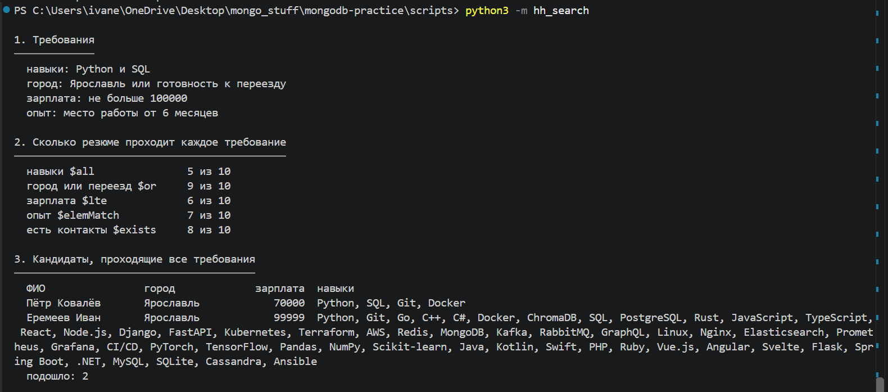

# Домашнее задание № 5 · Скрипт подбора кандидатов

Глава 2.9 справочника:

<https://maximbytecamp.github.io/mongodb_theory_makarov/temy/18-skript-podbor/index.html>

Скрипт лежит в репозитории практик в папке `scripts`: `hh_search.py`, `.rb`, `.go`, `.cpp`
(<https://github.com/MaximBytecamp/mongodb-practice>). Берите язык, на котором проходите справочник.

## Что сделать

1. **Разобраться в коде.** Прочитать главу и найти в скрипте, каким оператором сделан каждый
   из восьми разделов отчёта.
2. **Запустить** скрипт на своём стенде — команды в §10 главы.
3. **Другие требования.** В начале файла четыре переменные: навыки, город, потолок зарплаты,
   срок работы. Меняйте **по одной**, остальные возвращайте к исходным, запускайте и записывайте
   в таблицу, сколько кандидатов прошло раздел 3 «Все требования сразу».
4. **Своё резюме.** Добавить в `hh.resumes` через Compass (ADD DATA) одно своё резюме, которое
   проходит все исходные требования, и убедиться, что скрипт его нашёл. После работы вернуть базу:
   `docker compose run --rm reset` в папке `mongodb-practice` (сервер без Docker — `bash stend/load.sh`).

## Таблица

| Что изменено | Подошло кандидатов | Кто |
|---|---|---|
| ничего, исходные требования | 1 | Пётр Ковалёв |
| навыки: ["PostgreSQL", "Docker"] | 0 | Никто |
| город: Москва | 0 | Никто |
| потолок зарплаты: 500000 | 3 | Пётр Ковалёв, Ольга Пирогова, Алина Дроздова |
| срок работы: 3 месяцев | 2 | Пётр Ковалёв, Ксения Лапина |
| добавлено своё резюме | 2 | Пётр Ковалёв, Еремеев Иван |

## Скриншоты

Три кадра в `lesson_05/screens/`, вставить сюда:

- `01-zapusk.png` — запуск с исходными требованиями: видны команда и разделы 1–3;

- `02-drugie-trebovaniya.png` — запуск с изменённым требованием: видны раздел 1 и раздел 3;

- `03-svoe-rezyume.png` — своё резюме в разделе 3 отчёта.

## Вывод

Рекрутеру подошёл один кандидат, а нужно хотя бы три. Какое **одно** требование надо
смягчить и до какого значения, чтобы кандидатов стало не меньше трёх? Почему именно
это требование — объясните по числам разделов 2 и 8 отчёта. Проверьте ответ запуском.

**Ответ** - надо смягчить требования по потолку зарплаты, так как из-за этого требования не проходят почти половина кандидатов (только 6/10 проходят). Если увлечить потлок зарплаты с 100000 до 120000, то у нас прохожят уже три кандидата: Пётр Ковалёв, Ольга Пирогова, Алина Дроздова.

## Сдача

Ветка `hw-05`, Pull Request в свою `main`.