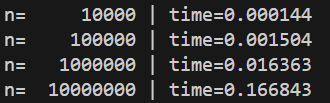
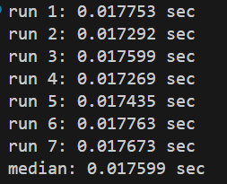
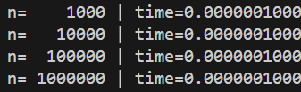
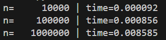
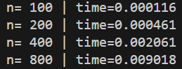
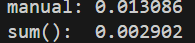
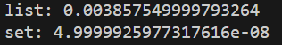
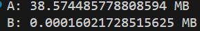
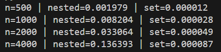

## Первый выполненый пример

Показано время выполнение алгоритма, который в цикле прибавляет +1 себе, начиная с нуля, пока не прошло n (в этом экземпляре n = 1 000 000) итераций. Сложность алгоритма O(n), поэтому программа завершилась достаточно быстро.

## Второй выполненный пример

Алгоритм тот-же что и в пером примере, но с различными значеними n. Так как сложность алгоритма O(n) времы выполнение растет линейно, как можно увидеть на скриншоте.

## Третий выполненный пример

Алгоритм тот-же что и в пером примере, но он выполняется несколько раз с одинаковым значением n. Можно увидеть что несмотря на то что алгоритм одинаковый, его время выполнение может менятся. Это происходит из-за внешних факторов ОС и загружености ЦП.

## Четвертый выполненный пример

Выполненный алгоритм возвращает значение, которое находится по середине массива размера n. Находит алгоритм число по индексу, а это значит что сложность алгоритма O(1), следовательно время выполение алгоритма не зависит от размера массива.

## Пятый выполненный пример

Время выполнение алгоритма линейного поиска со сложностью O(n) выростало линейно, что ожидаемо.

## Шестой выполненный пример

Выполненный алгоритм содержал вложенный цикл, что дает алгоритму сложность O(n^2). Из-за этого когда n увеличивался в два раза, то времы выполнение увеличивалось в 4 раза (2^2 = 4).

## Седьмой выполненный пример

Выполнились два алгоритма сумирования массива, первый написанный вручную нами, второй встроенный метод питона. Оба алгоритма имеют сложность O(n), но можно увидеть что встроенный метод sum() быстрее. То что два алгоритма имеют одинаковую сложность не значит что их время выполнение будет одинаковым, а значит что у них одинаковоя масштабируемость.

## Восьмой выполненный пример

Выполнились два алгоритма поиска элемента, в первом алгоритме поиск был по списку, а во втором алгоритме поиск был по set. Для list худший случай O(n), для set ожидаемая сложность O(1), худшая O(n), поэтому поиск по set был быстрее.

## Девятый выполненный пример

Выполнились два алгоритма суммирования квадратов, в варианте А все вычеслиные квадраты добавляются в один список, а только потом суммируются, когда в варианте Б на ходу к сумме добавляется только вычеленный квадрат. Оба алгоритма имеют сложность T O(n), но потребность в памяти у варианта А S O(n), а у варианта Б - S O(1). Эт объясяется созданием промежуточного списка в варианте А.

## Десятый выполненный пример

Выполнились два алгоритма: nested использует двойной вложенный цикл T(n^2), чтобы найти дубликаты в списке, и set, который использует структуру set T(n) для нахождение дубликатов. Рост времени выполнения х4 при увеличение n в два раза для nested было ожидаемо, так как nested имеет сложность T(n^2), а set имеет сложность T(n), поэтому время выполнение растет линейно с n. Но при этом set использует S(n) памяти, когда nested использует S(1).